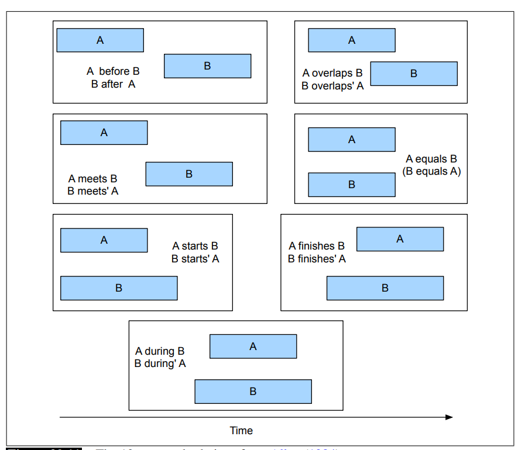
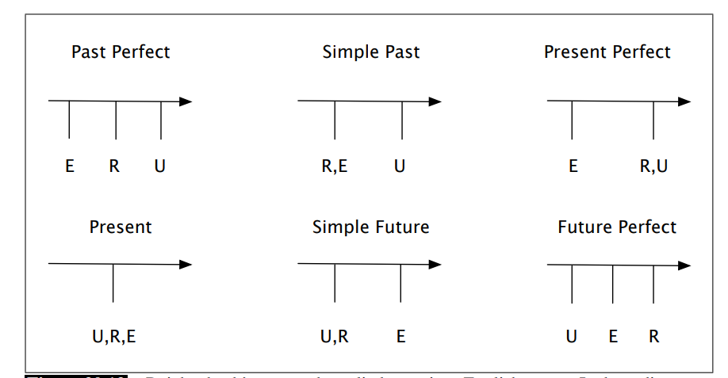

В данной главе приводится обзор задачи **выделения информации (Information extraction)**. 

* **Выделение отношений (relation extraction)** — выделение и классификация семантических связей между 2 сущностями по типу часть-целое, гипоним-гипероним или пространственные отношения. Используется для наполнения реляционныз БД или баз знаний.
* **Выделение событий (event extraction)** — поиск событий, действий, в которых участвуют сущности. Задача так же включает определение времеенных границ события. **Нормализацией во времени** события называют маппинг любых временных выражений, в т. ч. относительных *(на следующей неделе)* в абсолютные (календарные).
* **Template filling (заполнение шаблонов)** — выделение характеристик типовых событий по заранее заданному списку признаков.

## Выделение отношений
Отношения обычно описывается с помощью **RDF-triple (тройки subject-predicate-object)**. Существует проект **DBPedia**, хранящий миллиарды таких связей, собранный и самообновляющийся на материалах Википедии. **Freebase** — ещё один подобный проект. Проект **WordNet** содержит исключительно связи гипоним-гипероним. Датасет **TACRED** представляет собой 106,264 тройки 41 типа, размеченных в предложениях

**Алгоритмы выделения отношений** подразделить на 4 группы

1. Распознание на основе паттернов, заданных вручну.
2. Обучение с учителем
3. Частично контролируемое обучение
4. Обучение без учителя 

### Распознание паттернов
Также иногда носит название "паттерны Хёрста" — по фамилии изобретателя в 1992 году. Это буквально вручную прописанные правила формата "если в приложении можно выделить паттерн $N_0$, such as $N_1$, то $N_1$ и $N_0$ связан отношением "Гипоним-гипероним". Из преимуществ этого подхода можно выделить высокую точность и возможность адаптации к довольно специфическим предметным областям. Из недостатков стоит отметить низкую полноту, высокий объём работы для ручного написания всех возможных паттернов, а также слабую работу со флективными языками.

### Обучение с учителем
Имеется классическое машинное обучение с учителем -- с полноценным размеченным датасетом, тестовой и валидационной выборкой.
Задача может, например, быть поставлена так:

1. Выделить именованные сущности из текста
2. Подать на вход любому классификатору (на наличие отношения) все пары именованных сущностей, с учётом контекста либо без него

Классификаторы классического типа (Random Forest, линейная регрессия, перцептроны) могут принимать на вход признаки

1. **Векторное представление** — эмбеддинги BERT, tf-idf, Bag of words, "Bag of bigrams"
2.  **Признаки именованных сущностей** — тип (компания, человек, река), уровень ({NAME, NOMINAL, PRONOUN} ~ {название, тип, местоимение}, н-р, {Иван, человек, он})
3. **Синтаксические признаки** — количество других слов между именованным сущностями, синтаксические и грамматические признаки, синтаксический путь между 2 именованными сущностями

Основным недостатком такого метода является необходимость наличия размеченного датасета, что требует большого объёма усилий

### Частично контролируемое обучение: бутстрэппинг

В отличие от обучения с учителем, этот метод не требует размеченного датасета. Для его работы достаточно нескольких **исходных паттернов (seed patterns)** или **исходных кортежей (seed tuples)**. Этого достаточно, чтобы запустить процесс **бутстрэппинга** классификатора. Например:

1. Известно, что Ryanair и Шарлеруа связаны отношением "Авиакопания-хаб".
2. Запускается поиск всех предложений, имеющих слова Ryanair, Шарлеруа, хаб.
3. Затем, из этих предложений выделяется контекст между использованными словами и, возможно, по одному слову вокруг них
4. С использованием контекста, признаков именованных сущностей и прочих черт выделяются паттерны, образующие связь "Авиакомпания-хаб"

Подобные системы могут также выдавать паттернам **меру уверенности (confidence values)**. Она используется для избежания **семантического смещения (semantic drift)** — ситуации, когда ошибочные паттерны приводят к выделению ошибочных кортежей, которые приводят к выделению ошибчоных паттернов и т д.

Уверенность в паттерне можно оценить по следующей формуле:
$$
Conf_{RlogF}(p) = \frac{|hits(p)|}{|finds(p)|}\log(|finds(p)|)
$$
где:
* **hits(p)** — количество кортежей, которые найдены данным паттерном и помечены как seed tuples на данной итерации алгоритма
* **finds(p)** — общее количество кортежей, которые найдены данным паттерном.

Уверенность в кортеже тоже можно рассчитать. Предположим, у нас есть кортеж t и набор поддерживающих его паттернов P, для каждого из которых уже тоже рассчитана мера уверенность.

Тогда уверенность в кортеже можно рассчитать с помощью техники **noisy-or** — по сути просто перемножить вероятности, что все поддерживающие паттерны ошиблись одновременно

$$
Conf(t) = 1 - \prod_{p \in P'} (1 - Conf(p))
$$

### Частично контролируемое обучение: дистанционное обучение


Его идея заключается в том, что вместо набора из нескольких вручную заданных паттернов, мы берём данные из существующего крупного датасета и на их основе обучаем классификатор

1. Берём крупный существующий датасет (н-р, DBPedia)
2. Достаём из него все кортежи по некоторому отшению
3. Ищем все предложения, содержащих обе именованные сущности из кортежа
4. Все они признаются положительными примерами для данного типа отношений
5. На их основании можно выделить новые паттерны или же обучить классификатор, отвественный за выделение данного типа отношений. В связи с высоким объёмом обучающей выборки, можно получить довольно сложно устроенные паттерны.

Основным минусом данного подхода является высокая зашумлённость, т. к. на самом деле далеко не все найденные предложения явялются положительными примерами. То есть, метод имеет низкую точность и актуальные исследования нацелены на то, чтобы эту точность повысить. Ещё к недостаткам можно отнести потребность в большом датасете.

### Обучение без учителя
Целью алгоритмов, использующих обучение без учителя обычно является извлечение информации в условиях, где мы не имеем ни разметки, ни заранее известного списка возможных отношений (например, в открытом Интернете). Данная задача также иногда называется задачей **извлечения информации (Information Extraction, IE)**

Одна из систем, реализующих этот подход — **ReVerb (2011)**. Её алгоритм по извлечению информации из предложения:

1. В предложении определяет часть речи и границы сущностей (entities chunking)
2. Для каждого глагола с учётом набора ограничений берётся наибольшая последовательность **w** зависящих от него слов
3. Для каждого выражения с шага (2) найти ближайшее существительное слева и справа (игнорируя притяжательные местоимения, вопросительные слова, слово there), формируя таким образом тройку **(x, w, y)**
4. С помощью классификатора выяснить, содержит ли тройка **(x, w, y)** какое-нибудь отношение.

В список ограничений входит, например, правило, что глагол (или глагольные выражения вроде *have hub in*) является главным словом. Слишком длинные и редко встечающиеся выражения (потенциальные отношения) также отбрасываются. В оригинальное работе обрабатываются 500млн предложений, и извлечённые отношения добавляются в общий словарь, если встречаются хотя бы с 20 разными аргументами. В ходе работы извлечено 1.7 млн отношений.

Затем, каждое отношение подаётся на вход обученному классификатору, коорый выдаёт каждому отношению меру уверенности.

### Оценка алгоритмов выделения отношений

* Для методов обучения с учителем используется классические точность, полнота, $F$-мера.
* Для методов частично контролируемого и дистанционного обучения, обучения без учителя эти метрики не подходят, так как алгоритмы работают на неразмеченных и крайне больших объёмах данных данных. Предлагется метод оценки точности по части выборки следующим образом: 
$$
\hat{P} = \frac{\text{Количество найденных корректных кортежей}}{\text{Общее количество найденных кортежей}}
$$ 

### Выделение событий
Под задачей **выделения событий (event extraction)** подразумевается выделение событий из текста и размещение их на временной шкале.

В английском языке события обычно выражаются глаголами, но это не всегда так. Например, в событии *Increase took effect*  произошедшее событие — это повышение, а глагол, напротив, событием не является. Также обычно не являются событием **слабые глаголы (light verbs)** вроде *make, take, have*, они являются "синтаксической поддержкой" для событий, выраженных существительными (*took a flight*)

Системы извлечения событий могут иметь разные дополнительные цели, например, их классификацию (скажем, действия/состояния/сообщения), законченность и пр.
В качестве основного подхода для задачи извлечения событий используется обучение с учителем.

### Методы представления основных харакеристик событий
#### Представление времени
Основным способом представления относительного времени действия 2 интервальных событий является интервальная алгебра, представленная Алленом в 1984. Одномоментные события она не рассматривает. Ниже изображены все 13 **отношений Аллена**



Для событий, выраженных моментами, тоже не всё так просто. 
Авторы отмечают, что форма глагола не всегда связана с истинным временем события. Так, в фразе *Ok, we fly from San Francisco to Boston at 10* будущее время выражено глаголом настоящего.

Ещё один пример, который они отмечают

*Flight 1902 arrived late.*  
*Flight 1902 had arrived late*

Не все события, произошедшие в прошлом, равнозначны по своему временному расположению. Так, во втором примере подразумевается, что какое-то событие уже произошло к моменту описываемого. Для описания этого феномена Райхенбах в 1947 ввёл понятие **референсной точки (refernce point)**, то есть момента, о котором говорится, который используется как основной на момент опсиываемого события. С помощью этой схемы хорошо описываются основные времена английского языка.



$E$ — время события  
$R$ — референсная точка  
$U$ — время высказывания

В естественных языках время может описываться не только с помощью грамматической категории времени, но и с помощью временных выражений (*утром*, *после этого*) или метафорически, например, с помощью пространственных выражений (*около того*, *где-то в понедельник*)

#### Представление аспекта
С помощью аспекта события описываются по их внутренней временной струкутуре или временному контуру, то есть их завершённости, продолженности, регулярности. Выделяют категории:

1. **Состояния (States)** — неизменные продолжающиеся события (*я люблю поезда*)
2. **События (Events)** — всё, что не является состоянием
    1. **Деятельность (Activity)** — продолжающиеся события без чётко обозначенной точки завершения (*Я живу в Москве*, *Она ехала на Мазде*)
    2. **Выполнения (Accomplishment)** — события, занявшие определённое время и имеющие чёткую точку завршения. Также  называются **целенаправленными (telic)** событиями. (*Он забронировал столик*)
    3. **Достижения (Achievement)** — события, имеющие чёткую точку завершения, но не имеющие продолжительности. (*Она нашла свой выход на посадку*)

**Stative:** I know my departure gate.  
**Activity:** John is flying.  
**Accomplishment:** Sally booked her flight.  
**Achievement:** She found her gate.

### Алгоритмы выделения времени 
Основным датасетом является **TimeBank**. Он содержит английские тексты с разметкой 3 типов объектов — EVENT (события и состояни), TIME (выражения, описывающие время), LINK (связи событий с временными выражениями). LINK разделяются на TLINK (по Аллену), ALINK (аспект), SLINK.

##### Пример из датасета TimeBank
```xml
<TIMEX3 tid="t57" type="DATE" value="1989-10-26" functionInDocument="CREATION_TIME">
  10/26/89
</TIMEX3>
Delta Air Lines earnings
<EVENT eid="e1" class="OCCURRENCE">soared</EVENT>
33% to a record in
<TIMEX3 tid="t58" type="DATE" value="1989-Q1" anchorTimeID="t57">
  the fiscal first quarter
</TIMEX3>,
<EVENT eid="e3" class="OCCURRENCE">bucking</EVENT>
the industry trend toward
<EVENT eid="e4" class="OCCURRENCE">declining</EVENT>
profits.

```
* $\text{Soaring}_{e1}$ is included in $\text{the fiscal first quarter}_{t58}$
* $\text{Soaring}_{e1}$ is before $\text{1989-10-26}_{t57}$
* $\text{Soaring}_{e1}$ is simultaneous with $\text{the bucking}_{e3}$
* $\text{Declining}_{e4}$ includes $\text{soaring}_{e1}$

Основные шаги при выделении времени:

1. Выделение **временных выражений**
2. **Нормализация** выражений через приведение их в стандартный формат
3. **Соотнесение** их с событиями, создания временного графа или временной линии

#### Выделение временных отношений

1. **Абсолютные** — могут быть напрямую соотнесены с датой или временем
2. **Относительные** — указывают на время, относительно некоторого события или референсной точки. (*a week from last tuesday*)
3. **Длительность** — промежутки времени

| **Absolute**            | **Relative**             | **Durations**           |
| ----------------------- | ------------------------ | ----------------------- |
| April 24, 1916          | yesterday                | four hours              |
| The summer of ’77       | next semester            | three weeks             |
| 10:15 AM                | two weeks from yesterday | six days                |
| The 3rd quarter of 2006 | last quarter             | the last three quarters |


Временные выражения часто имеют **лексические триггеры** в качестве своих главных слов, что делает их выделение проще

| **Category** | **Examples**                                                |
| ------------ | ----------------------------------------------------------- |
| Noun         | *morning, noon, night, winter, dusk, dawn*                  |
| Proper Noun  | *January, Monday, Ides, Easter, Rosh Hashana, Ramadan, Tet* |
| Adjective    | *recent, past, annual, former*                              |
| Adverb       | *hourly, daily, monthly, yearly*                            |

Для выделения выражений можно использовать подходы, основанные на правилах. Например, наборы регулярных выражений на основе частей речи или определённых лексических единиц.
Ещё один подход — машинное обучение. Каждому слову должна быть выдана метка на основе стандарной **IOB-схемы** (inside, outside, beginning). 
```
A fare increase initiated last week by UAL Corp’s...  
 O   O     O         O      B    I   O   O    O    
```

#### Нормализация временных отношений
**Временная нормализация** — это задача представления временных выражений как точки во времени или как длительности. 
Нормализованное время обычно представляется в формате ISO

```xml
<TIMEX3 id="t1" type="DATE" value="2007-07-02" functionInDocument="CREATION_TIME">
  July 2, 2007
</TIMEX3>
A fare increase initiated
<TIMEX3 id="t2" type="DATE" value="2007-W26" anchorTimeID="t1">
  last week
</TIMEX3>
by United Airlines was matched by competitors over
<TIMEX3 id="t3" type="DURATION" value="P1WE" anchorTimeID="t1">
  the weekend
</TIMEX3>,
marking the second successful fare increase in
<TIMEX3 id="t4" type="DURATION" value="P2W" anchorTimeID="t1">
  two weeks
</TIMEX3>.
```

| Unit                     | Pattern             | Sample Value       |
|--------------------------|-------------------|------------------|
| Fully specified dates    | YYYY-MM-DD         | 1991-09-28       |
| Weeks                    | YYYY-Wnn           | 2007-W27         |
| Weekends                 | PnWE               | P1WE             |
| 24-hour clock times      | HH:MM:SS           | 11:13:45         |
| Dates and times          | YYYY-MM-DDTHH:MM:SS| 1991-09-28T11:00:00 |
| Financial quarters       | Qn                 | 1999-Q3          |

(**P** в формате ISO означает period, продолжительность)

Современные подходы для нормализации времени в основном rule-based. Например, для 2 распознанных паттернов временных выражений можно определить операцию DURATION, которая определит длительность между ними.

Задача нормализации времени явялется довольно сложной, поскольку в документах довольно редко встречаются чёткие указания на дату и время. Чаще они ссылаются, например, на время написания документа — эту дату называют **temporcal anchor, временным якорем**.  На основе этого якоря можно рассчитывать даты, упоминающиеся со словами *yesterday, tomorrow, next week*. Стоит отметить, что этого тоже недостаточно. Рассмотрим примеры

* *Random security checks that began yesterday at Sky Harbor will continue
at least through **the weekend**.*
* *A fare increase initiated by United Airlines was matched by competitors over   **the weekend** marking the second successful fare increase in   two weeks*

В первом случае **the weekend** ссылается на предстоящий уикэнд, а во втором — на прошедший.

Это может зависеть не только от временных форм глагола. Так, выражение *в следующую пятницу*, сказанное в субботу, будет скорее всего иметь в виду ближайшую пятницу, а выражение *в следующую пятницу*, сказанное в четверг, скорее всего будет подразумевать уже не ближайшую пятницу, а ту, которая будет за ней.

Такие неоднозначности обычно разрешаются разнообразными эвристиками, специфичными для языка и предметной области.

#### Упорядочивание событий во времени.